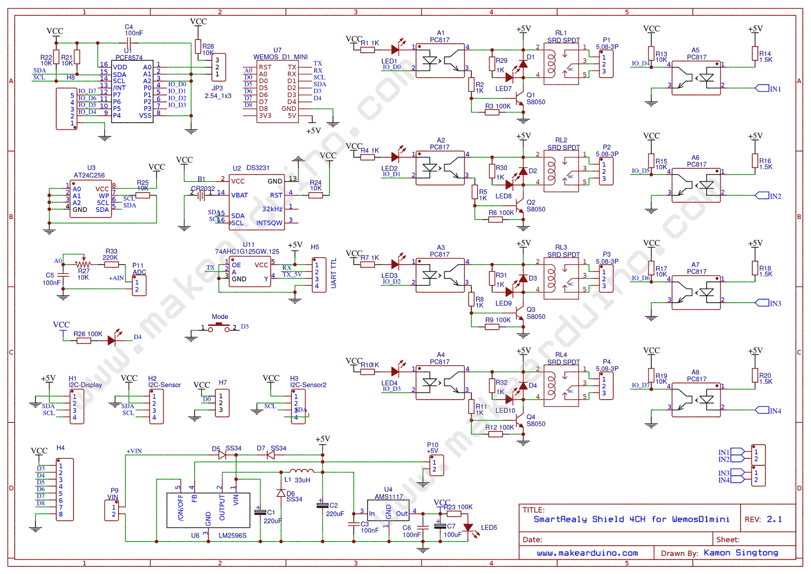

# ESP8266-Smart Relay 4 Channel for Wemos D1 mini
---

Supported board : https://www.makearduino.com/product/61/esp8266-wifi-smart-relay-4-channel-for-wemos-d1-mini

<a href="./documents/manual.pdf" target="_blank">User Manual</a>

<h2>Board Schematic</h1>

